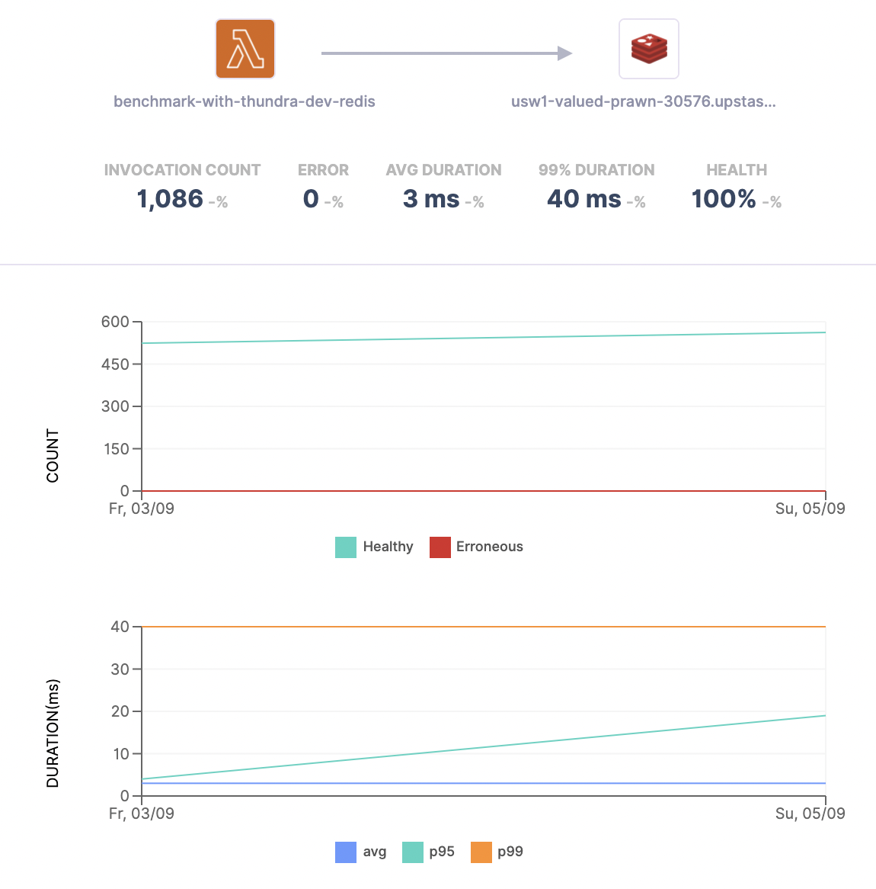
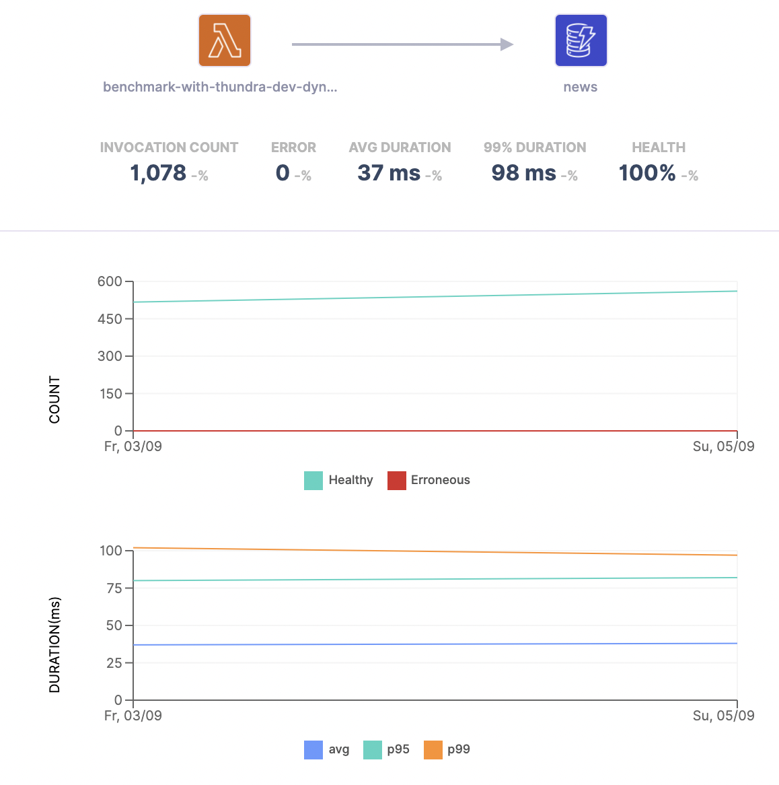

<br />
<div align="center">

  <h3 align="center">Benchmark Your Serverless Database with Thundra</h3>

  <p align="center">
    Thundra empowers you to benchmark your serverless database performance effortlessly by integrating Upstash Redis, enabling accurate measurement, analysis, and optimization of your database operations.
  </p>
</div>

Here, we benchmarked two AWS Lambda functions which fetch records from two different Serverless databases: AWS DynamoDB and Upstash Redis.

Both databases are loaded with 7001 sample articles and both functions fetch top 10 articles with a query equivalent to:

```shell
select * from news where section = ‘World’ order by view_count desc;
```

### Redis Results



### DynamoDB Results



### Learn More

To learn more about Upstash and its services, check out the following resources:

- [Documentation](https://docs.upstash.com)
- [Website](https://upstash.com)
- [Blog](https://upstash.com/blog)
- [Console](https://console.upstash.com)
- [Discord](https://upstash.com/discord)
