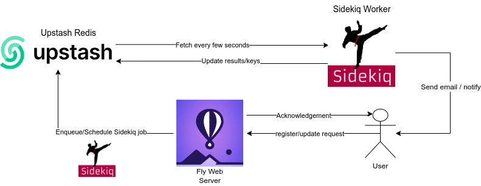

 

  <h3 align="center"> Sidekiq Mailer</h3>

  

    Learn how to create a mailer app using Ruby and Sidekiq
  

## A simple scenario, showcasing background job processing capabilities by using Upstash Redis.

Assume you provide a service: When users sign-up for your service, you want to have an automated behaviour, whether it is generating user specific objects or adding them to your list of customers. For this kind of workflow, we will take automated emailing, emulated by simply console logging.

If the users are free or paid tier, you want to notify and welcome them to your platform after certain time: 3 hours, 3 days etc. After all, they may quit or delete their accounts. 

But whenever a user starts as an enterprise, you want to send notifications immediately, whenever the server is available.

Or when they upgrade their plan, you want to immediately congratulate them.

## Deploy on Fly !
`flyctl redis create` --> Create your Upstash Redis resource. Then:

`flyctl secrets set UPSTASH_REDIS_LINK=<connection-link-from-upstash-redis>`

`flyctl launch` --> Use the already created `.toml`. With the procfile, both the server and the worker will be deployed and be ready for action!

## API
`get /clear` --> will clear all the scheduled and queued jobs. 

`get /register/:id/:plan` --> will schedule or enqueue Sidekiq job, delayed depending on the plan. 

`get /update/:id/:plan` --> will enqueue Sidekiq job and remove previously created job regarding the id.

## OR Deploy Locally
### Configure Package
`bundle install`

### Run Worker
`bundle exec sidekiq -r ./sendEmail.rb`

This command will start the worker. From there on, any request coming from clients - or in the server itself - will be fetched and applied in this worker.

### Run Web Server
`rackup`
This will start the sinatra server.

#### OR Send processes via Client
`bundle exec irb -r ./sendEmail.rb`
`createEmail(<id>, <type>)` for scheduled run.
`updateEmail(<id>, <type>)` for updating the email to be sent.

( `client.sh` has some example calls and `sampleLogs.log` shows an example output regarding that .sh file )

### Learn More

To learn more about Upstash and its services, check out the following resources:

- [Documentation](https://docs.upstash.com)
- [Website](https://upstash.com)
- [Blog](https://upstash.com/blog)
- [Console](https://console.upstash.com)
- [Discord](https://upstash.com/discord)

